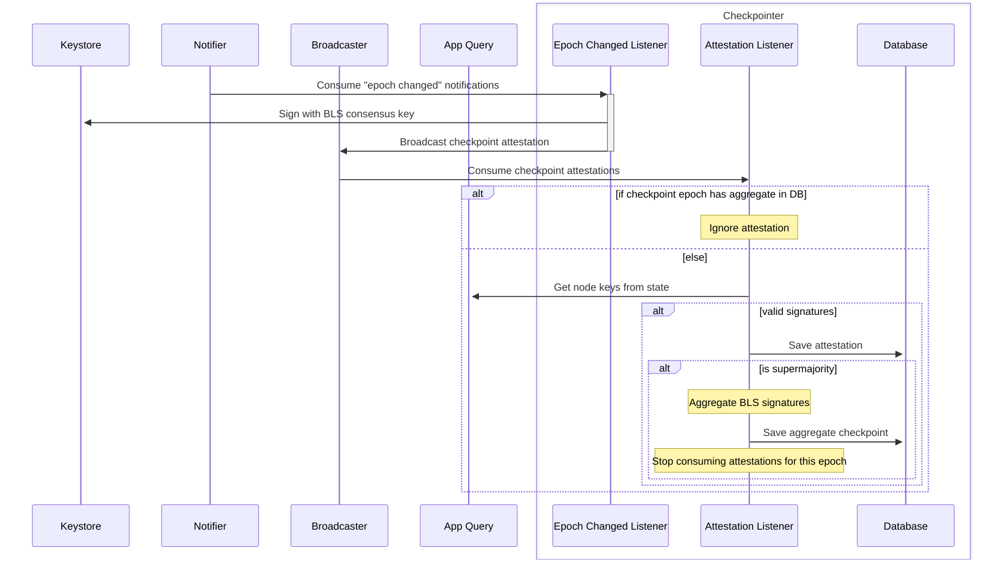

# Lightning Checkpointer

The [checkpointer](./src/checkpointer.rs) is a component that produces checkpoint attestations and aggregates them when a supermajority is reached.

The goal of the checkpointer is to provide a mechanism for clients to efficiently and securely verify the blockchain state without traversing the history of transactions. Checkpoints at every epoch contain a state root, with an aggregate BLS signature over it, that a supermajority of nodes have attested to. Clients can use these state roots to verify inclusion or non-inclusion of anything in the state at each epoch.

The checkpointer listens for epoch change notifications from the notifier and checkpoint attestation messages from the broadcaster. It's responsible for creating checkpoint attestations and checking for a supermajority of attestations for the epoch, aggregating the signatures if a supermajority is reached, and saving the aggregate checkpoint to the database as the canonical checkpoint for the epoch. The aggregate checkpoint contains a state root that can be used by clients to verify the blockchain state using merkle proofs.

## Dependencies

- [Notifier](../notifier): Facilitates epoch change notifications from the application.
- [Broadcaster](../broadcaster): Broadcasts checkpoint attestations to other nodes.
- [Keystore](../keystore): Provides access to the node's BLS consensus signing key.
- [Application/Query](../application): Provides query access to the node's state.

## Components

- [EpochChangeListener](./src/epoch_change_listener.rs): Listens for epoch change notifications from the notifier and creates checkpoint attestations.
- [AttestationListener](./src/attestation_listener.rs): Listens for checkpoint attestations from the broadcaster and checks for a supermajority of attestations for the epoch.
- [Database](./src/database.rs): Stores the checkpoint attestations and the aggregate checkpoint.

## Protocol

- On `EpochChangedNotification` from the notifier, the [epoch change listener](./src/epoch_change_listener.rs):

  - Consumes the notification and retrieves the epoch from the notification payload.
  - Retrieves the BLS consensus signing key for the epoch from the keystore.
  - Creates a checkpoint attestation for the epoch using the BLS consensus signing key.
  - Saves the checkpoint attestation to the database.
  - Broadcasts the checkpoint attestation to the broadcaster.

- On `CheckpointerMessage::Attestation` from the broadcaster, the [attestation listener](./src/attestation_listener.rs):
  - Consumes the checkpoint attestation.
  - Retrieves the node keys for the epoch from the application query.
  - Validates the checkpoint attestation signatures.
  - Saves the checkpoint attestation to the database.
  - Checks for a supermajority of checkpoint attestations for the epoch.
  - If a supermajority is reached, the checkpointer:
    - Aggregates the signatures of the valid checkpoint attestations.
    - Saves the aggregate checkpoint to the database as the canonical checkpoint for the epoch.
    - Stops consuming checkpoint attestations for the epoch.

## Diagrams

