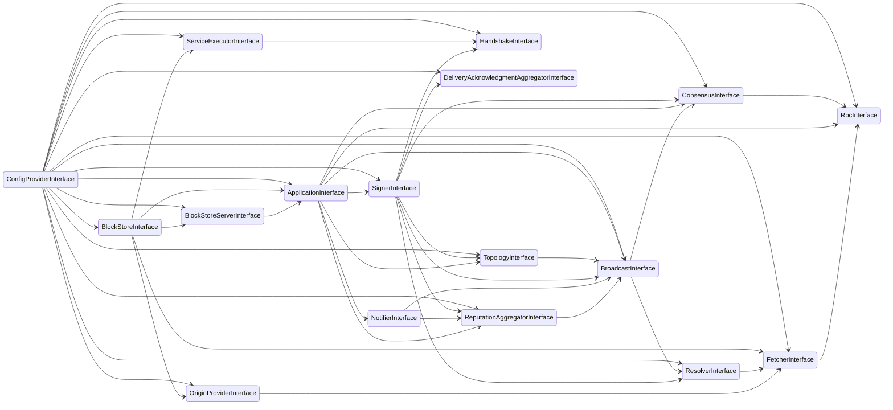

# Fleek Network Dependency Graph

```mermaid
stateDiagram-v2
  direction LR
  ConfigProviderInterface --> ApplicationInterface
  BlockStoreInterface --> ApplicationInterface
  BlockStoreServerInterface --> ApplicationInterface
  ConfigProviderInterface --> BlockStoreInterface
  ConfigProviderInterface --> BlockStoreServerInterface
  BlockStoreInterface --> BlockStoreServerInterface
  ConfigProviderInterface --> BroadcastInterface
  ApplicationInterface --> BroadcastInterface
  TopologyInterface --> BroadcastInterface
  SignerInterface --> BroadcastInterface
  NotifierInterface --> BroadcastInterface
  ReputationAggregatorInterface --> BroadcastInterface
  ConfigProviderInterface --> TopologyInterface
  SignerInterface --> TopologyInterface
  ApplicationInterface --> TopologyInterface
  ConfigProviderInterface --> ConsensusInterface
  SignerInterface --> ConsensusInterface
  ApplicationInterface --> ConsensusInterface
  BroadcastInterface --> ConsensusInterface
  ConfigProviderInterface --> HandshakeInterface
  ServiceExecutorInterface --> HandshakeInterface
  SignerInterface --> HandshakeInterface
  ApplicationInterface --> NotifierInterface
  ConfigProviderInterface --> OriginProviderInterface
  BlockStoreInterface --> OriginProviderInterface
  ConfigProviderInterface --> DeliveryAcknowledgmentAggregatorInterface
  SignerInterface --> DeliveryAcknowledgmentAggregatorInterface
  ConfigProviderInterface --> ReputationAggregatorInterface
  SignerInterface --> ReputationAggregatorInterface
  NotifierInterface --> ReputationAggregatorInterface
  ApplicationInterface --> ReputationAggregatorInterface
  ConfigProviderInterface --> ResolverInterface
  BroadcastInterface --> ResolverInterface
  SignerInterface --> ResolverInterface
  ConfigProviderInterface --> RpcInterface
  ConsensusInterface --> RpcInterface
  ApplicationInterface --> RpcInterface
  FetcherInterface --> RpcInterface
  ConfigProviderInterface --> ServiceExecutorInterface
  BlockStoreInterface --> ServiceExecutorInterface
  ConfigProviderInterface --> SignerInterface
  ApplicationInterface --> SignerInterface
  ConfigProviderInterface --> FetcherInterface
  BlockStoreInterface --> FetcherInterface
  ResolverInterface --> FetcherInterface
  OriginProviderInterface --> FetcherInterface
```
