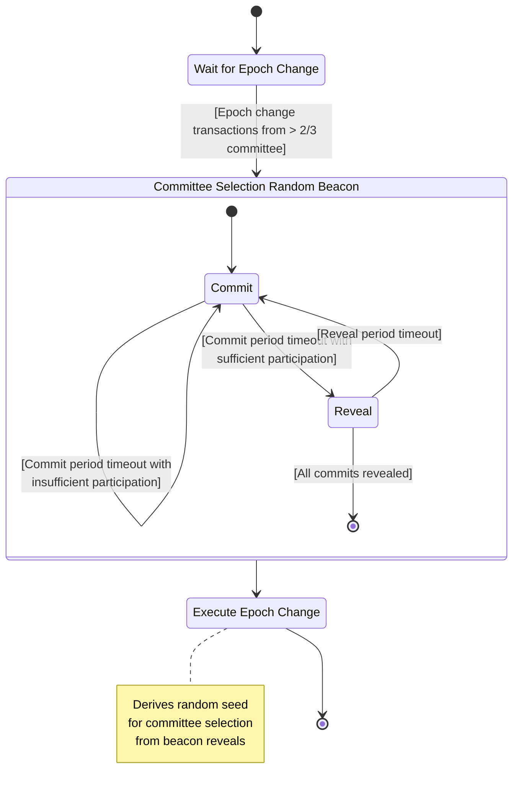

# Committee Beacon

The committee beacon component participates in and drives a commit-reveal process that provides randomness for selecting the next committee.

## Process

## Transactions

The following transactions are submitted by the committee beacon component (as the current node) to drive the process:

`CommitteeSelectionBeaconCommit`

- Submitted by nodes when they see a block was executed at the beginning of the commit phase (first block of the phase block range).
- Revert if not in commit phase.
- Revert if commitment from the node already exists for the current round.
- Revert if the node committed in the previous round but did not reveal.
- Save the node’s beacon commitment to the state.
- If all eligible nodes have committed, transition to the reveal phase.

`CommitteeSelectionBeaconReveal`

- Submitted by nodes when they see a block was executed at the beginning of the reveal phase (first block of the phase block range).
- Revert if not in reveal phase.
- Revert if node did not commit.
- Revert if the reveal does not match the commitment.
- Save beacon reveal to the state.
- If all committed nodes have revealed, execute epoch change.

`CommitteeSelectionBeaconCommitPhaseTimeout`

- Submitted by nodes when they see a block was executed outside of the commit phase (outside of the phase block range).
- Verifies that the commit phase has timed out.
- If sufficient participation is met, transition to the reveal phase.
- If insufficient participation, reset and restart a new commit phase.

`CommitteeSelectionBeaconRevealPhaseTimeout`

- Submitted by nodes when they see a block was executed outside of the reveal phase (outside of the phase block range).
- Verifies that the reveal phase has timed out.
- Slash nodes that did not reveal, reset and restart a new commit phase.

## State

The following application/blockchain state is used to drive the process:

- Protocol parameters:
  - `CommitteeSelectionBeaconCommitPhaseDuration`
  - `CommitteeSelectionBeaconRevealPhaseDuration`
- Metadata
  - `Metadata::CommitteeSelectionBeaconPhase`
    - Enum:
      - `Commit(BlockRange)`
      - `Reveal(BlockRange)`
  - `Metadata::CommitteeSelectionBeaconRound`
    - `u64`- incremented one every new retry of the process within an epoch
- `committee_selection_beacons`
  - Key: `NodeIndex`
  - Value:
    - `commit: [u8; 32]` - SHA3 hash of reveal value.
    - `reveal: Option<[u8; 32]>` - Secret random 32-byte value.
