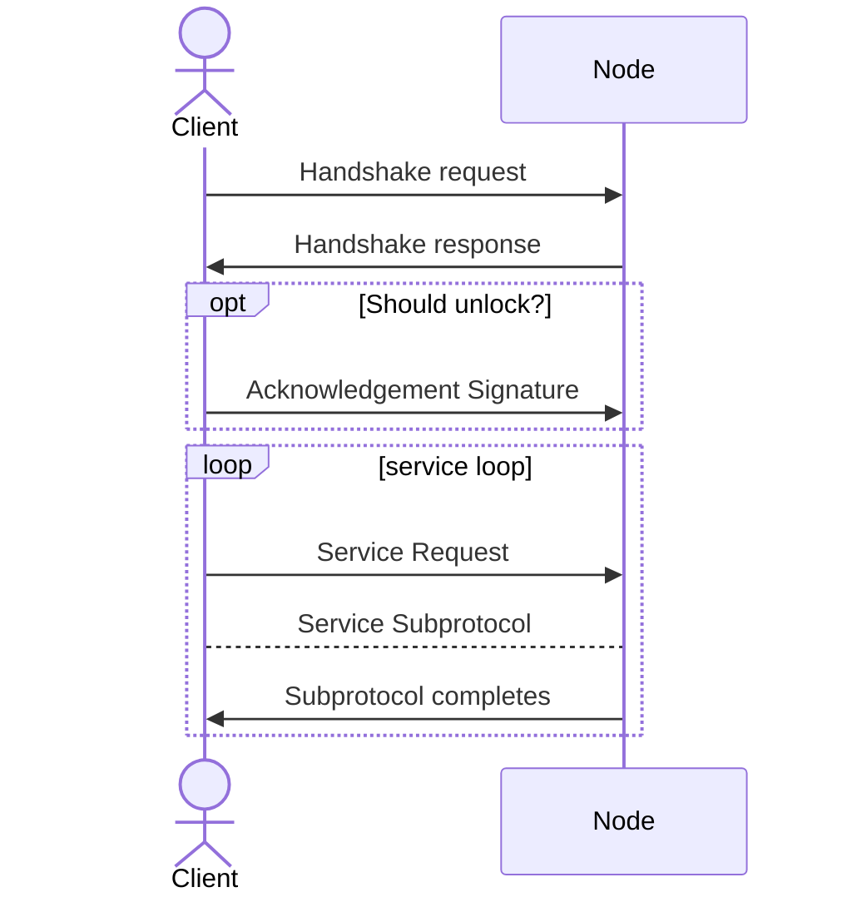

# Service Handshake Protocol

Nodes allow for a certain number of lanes for a client to run services within.
The handshake protocol provides a way for a client to request a lane, or unlock a disconnected lane,
and initiate a service.



## Codec

### Frame Tags

Each frame is prefixed by a 1 byte tag. The signal flag will always be set to 0.

```
0 [ 0 0 0 0 0 0 0 ] - tag bitmap
 \_ signal flag
```

### Termination Signals

When the connection can be gracefully terminated, a client or server can provide a 1 byte signal with a reason.
The signal flag will always be set to 1.

```
1 [ 0 0 0 0 0 0 0 ] - reason bits
 \_ signal flag

Termination Reasons:
0x80: Codec Violation
0x81: Out of Lanes
0x82: ...
0xFF: Unknown
```

### Handshake Request Frame

```
TAG = 0x01 << 0

[ TAG . b"FREEK" . version (u8) . supported compression bitmap (u8) . pubkey (48 bytes) . optional unlock lane (u8) ]

Length: 57 bytes

Supported Compression Bits:
SNAPPY = 0x01 << 0
GZIP = 0x01 << 1
LZ4 = 0x01 << 2

If lane is 0xFF, the node should select an open lane for the client. Otherwise, the lane provided should be unlocked.
```

### Handshake Response Frame

```
TAG = 0x01 << 1

[ TAG . lane (u8) . node pubkey (33 bytes) . nonce (u64) ]

Length: 43 bytes
```

### Handshake Response Frame (Unlock Lane)

> TODO: Figure out commodities 

```
TAG = 0x01 << 2

[ TAG . lane (u8) . node pubkey (33 bytes) . nonce (u64) . last service id (32 bytes) . last bytes (u64) . last delivery ack (96) ]

Length: 179 bytes
```

### Delivery Acknowledgment Frame 

```
TAG = 0x01 << 3

[ TAG . signature (96 bytes) ]

Length: 97 bytes
```

### Service Request Frame 

```
TAG = 0x01 << 4

[ TAG . service id ]

Length: 33 bytes
```
