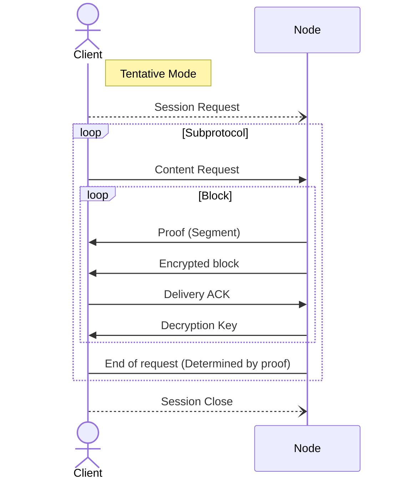
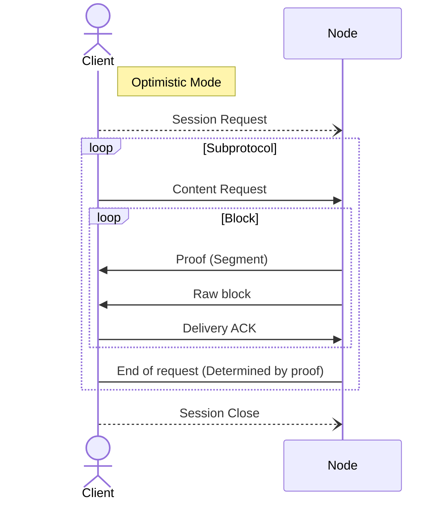
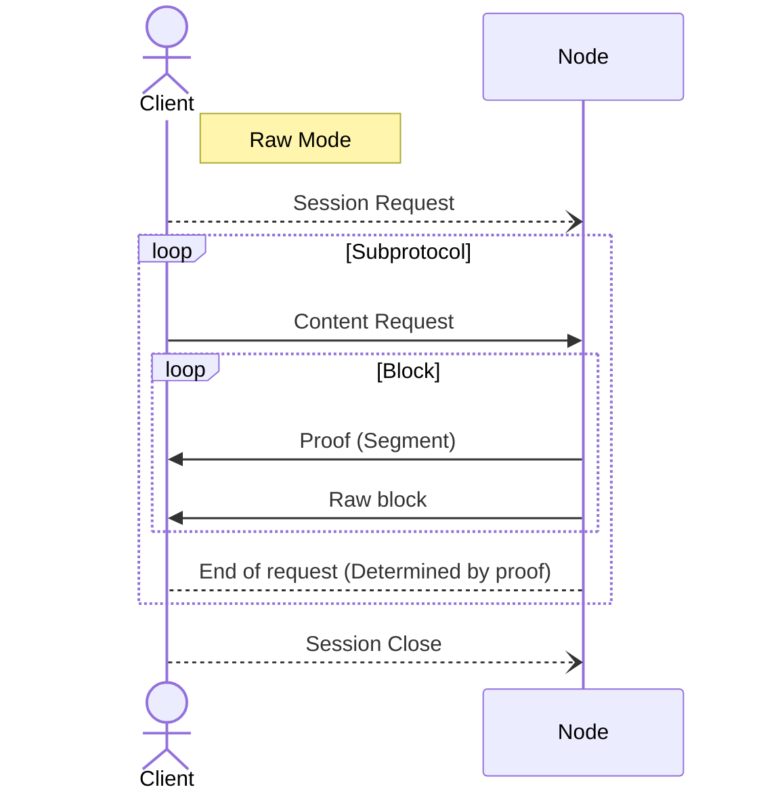

# Blake3 Verified Streaming Service

The verified streaming service uses blake3 proofs to stream content to a client with a given hash, while collecting proof of delivieries for each block.

The service has 3 modes:

- Tentative mode, in which the node encrypts each block with a key, and only provides it to the client after the block has been acknowledged.
- Optimistic mode, in which the node sends an unencrypted block optimistically, and waits for the client to acknowledge it before sending another one.
- Raw mode, in which the node streams the raw content without expecting any client acknowledgements.

### Tentative Mode


    
### Optimistic Mode  


    
### Raw mode


    
## Codec

### Content Request
    
```
TAG = 0x01 << 0

[ TAG . blake3 hash ]
```
    
### Content Range Request
    
```
TAG = 0x01 << 1

[ TAG . blake3 hash . starting block (u64) . num blocks (u16) ]

If number of blocks is 0, the content should be served up to the last block
```
    
### Content Block Response:
    
```
TAG = 0x01 << 2

[ TAG . compression . commitment . proof len (u64) . bytes len (u64) . proof . bytes ]
```
    
### Delivery Acknowledgement: 

Client sent acknowledgement proving the node sent a block of content
        
```
TAG = 0x01 << 3

[ TAG . signature ]
```
        
### Decryption Key: 

Sent by the node for the client to actually get their content in the tentative mode.

```
TAG = 0x01 << 4

[ TAG . decryption key ]
```
        
### Signals

Sent from a node to a client to notify about certain things. A single byte (above 0x80) is enough to provide a signal id and some data bits 

```
[ 0x80 | signal id | data bits ]
      
1 [ 0 0 0 ] [ 0 0 0 0 ] - data bits
 \     \_ Signal Id
  \_ Signal bit
        
Signal Ids:
000: Update Service Epoch
111: Termination(reason)

Termination Reasons:
0000: Codec Violation
0001: InsufficientBalance
1111: Unknown
```
